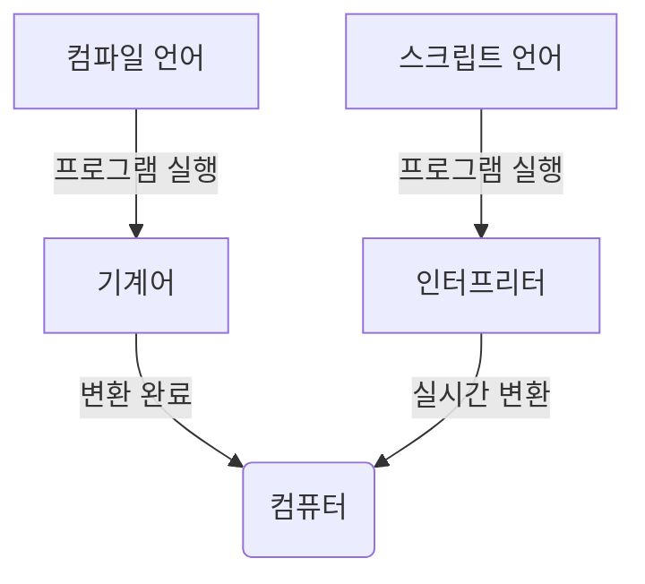

import { Cards, Card, Callout} from 'nextra/components'
import {Icon} from '/utils/Module.jsx'

<Cards>
<Card icon={<Icon.arrow_left/>} title="돌아가기" href="/project/WikiBlog" />
</Cards>

<br/>
# Mermaid
`Mermaid` 확장을 제공합니다. 이를 통해 간단한 도식 그래프를 포스팅 할 수 있습니다.
[사용 예시](https://mermaid.live)

` ```mermaid``` ` 를 상단에 명시하여 사용합니다.



```md filename="Markdown"
flowchart TD
    A[컴파일 언어] -->|프로그램 실행| B[기계어] -->|변환 완료| F(컴퓨터)
    C[스크립트 언어] -->|프로그램 실행| D[인터프리터] -->|실시간 변환| F(컴퓨터)
```